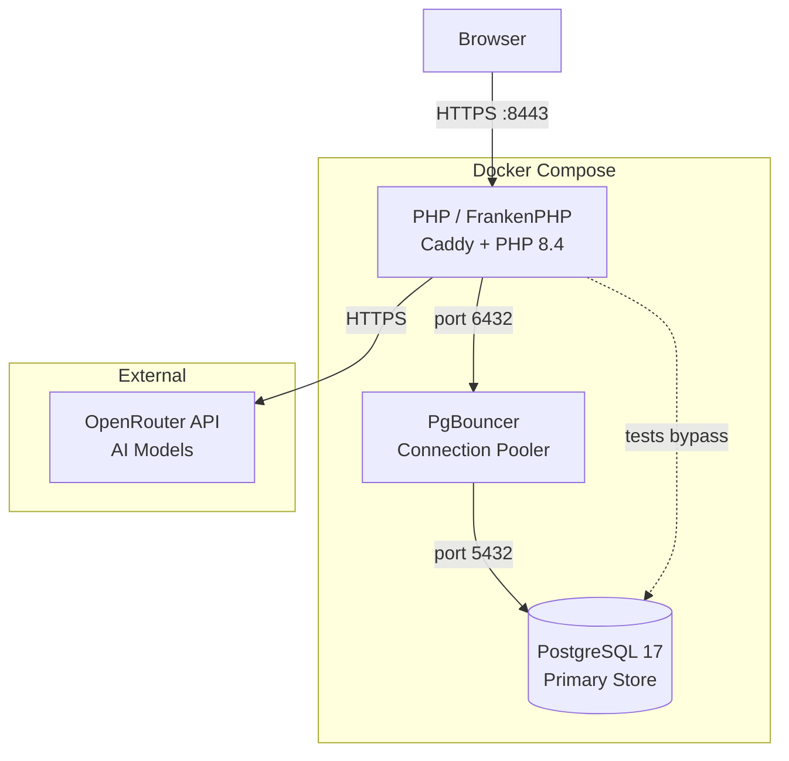
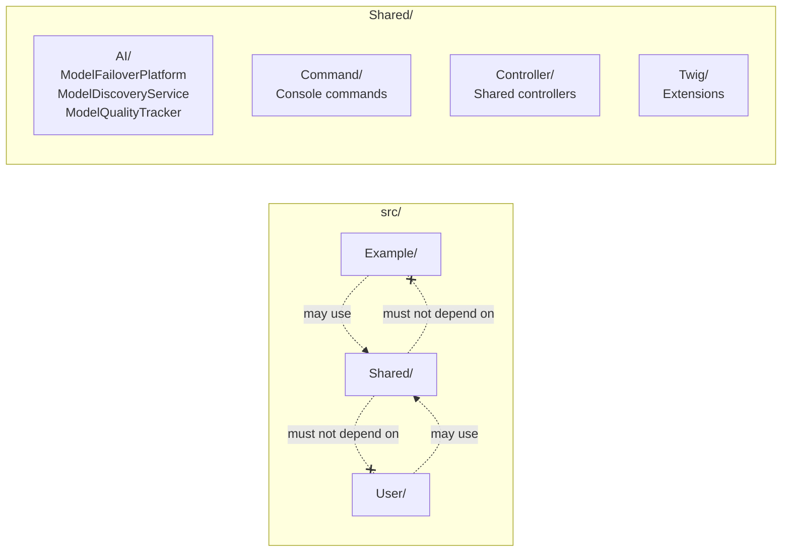
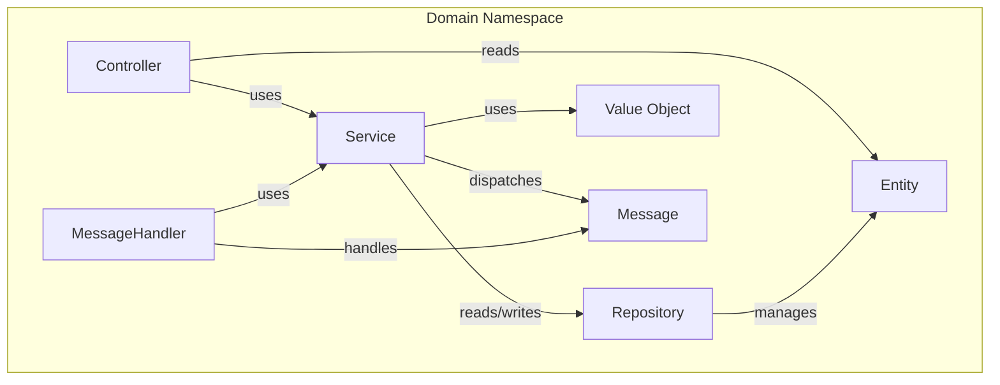
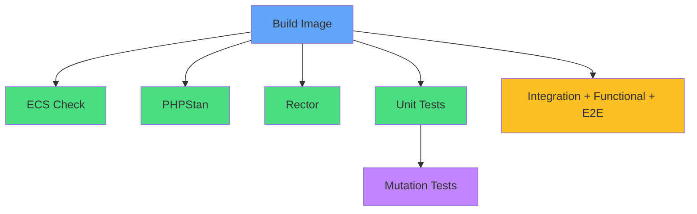

# Architecture

## System Overview

```mermaid
graph TD
    subgraph Docker Compose
        PHP[PHP / FrankenPHP<br/>Caddy + PHP 8.4]
        PGB[PgBouncer<br/>Connection Pooler]
        DB[(PostgreSQL 17<br/>Primary Store)]
    end

    Browser[Browser] -->|HTTPS :8443| PHP
    PHP -->|port 6432| PGB
    PGB -->|port 5432| DB
    PHP -.->|tests bypass| DB

    subgraph External
        OR[OpenRouter API<br/>AI Models]
    end

    PHP -->|HTTPS| OR
```

## Domain Structure

```mermaid
graph LR
    subgraph "src/"
        EX[Example/]
        US[User/]
        SH[Shared/]
    end

    subgraph "Shared/"
        AI[AI/<br/>ModelFailoverPlatform<br/>ModelDiscoveryService<br/>ModelQualityTracker]
        CMD[Command/<br/>Console commands]
        CTRL[Controller/<br/>Shared controllers]
        TWIG[Twig/<br/>Extensions]
    end

    EX -.->|may use| SH
    US -.->|may use| SH
    SH -.-x|must not depend on| EX
    SH -.-x|must not depend on| US
```

## Domain Pattern

```mermaid
graph TD
    subgraph "Domain Namespace"
        C[Controller] -->|reads| E[Entity]
        C -->|uses| S[Service]
        S -->|reads/writes| R[Repository]
        R -->|manages| E
        S -->|uses| VO[Value Object]
        S -->|dispatches| M[Message]
        MH[MessageHandler] -->|handles| M
        MH -->|uses| S
    end
```

## AI Failover Chain

```mermaid
graph LR
    REQ[Request] --> MFP[ModelFailoverPlatform]
    MFP --> M1[openrouter/free]
    M1 -->|fail| M2[minimax/minimax-m2.5:free]
    M2 -->|fail| M3[z-ai/glm-4.5-air:free]
    M3 -->|fail| M4[openai/gpt-oss-120b:free]
    M4 -->|fail| M5[qwen/qwen3.6-plus:free]
    M5 -->|fail| M6[nvidia/nemotron-3-super-120b-a12b:free]
    M6 -->|fail| ERR[Exception]

    style M1 fill:#4ade80
    style ERR fill:#f87171
```

## CI Pipeline

```mermaid
graph TD
    BUILD[Build Image] --> ECS[ECS Check]
    BUILD --> PHPSTAN[PHPStan]
    BUILD --> RECTOR[Rector]
    BUILD --> UNIT[Unit Tests]
    BUILD --> INT[Integration + Functional + E2E]
    UNIT --> MUT[Mutation Tests]

    style BUILD fill:#60a5fa
    style ECS fill:#4ade80
    style PHPSTAN fill:#4ade80
    style RECTOR fill:#4ade80
    style UNIT fill:#4ade80
    style INT fill:#fbbf24
    style MUT fill:#c084fc
```
